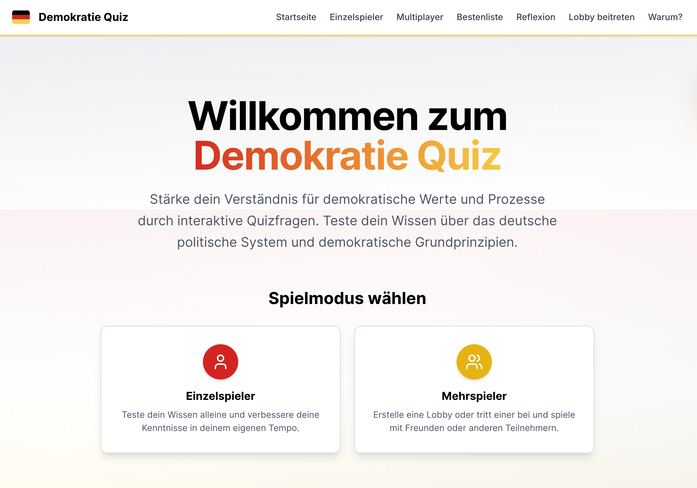
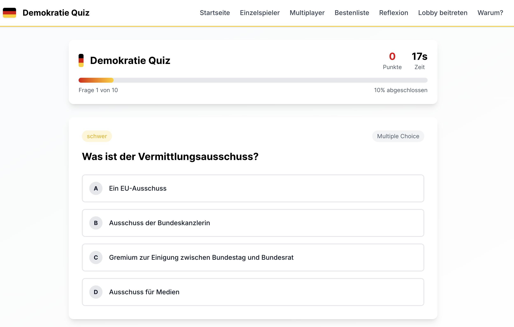
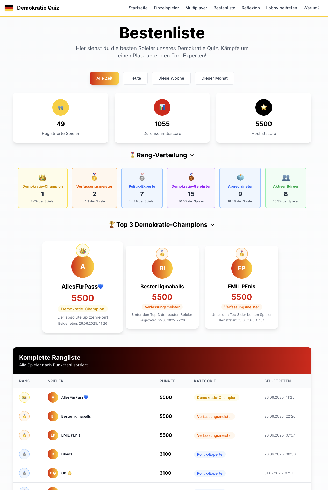
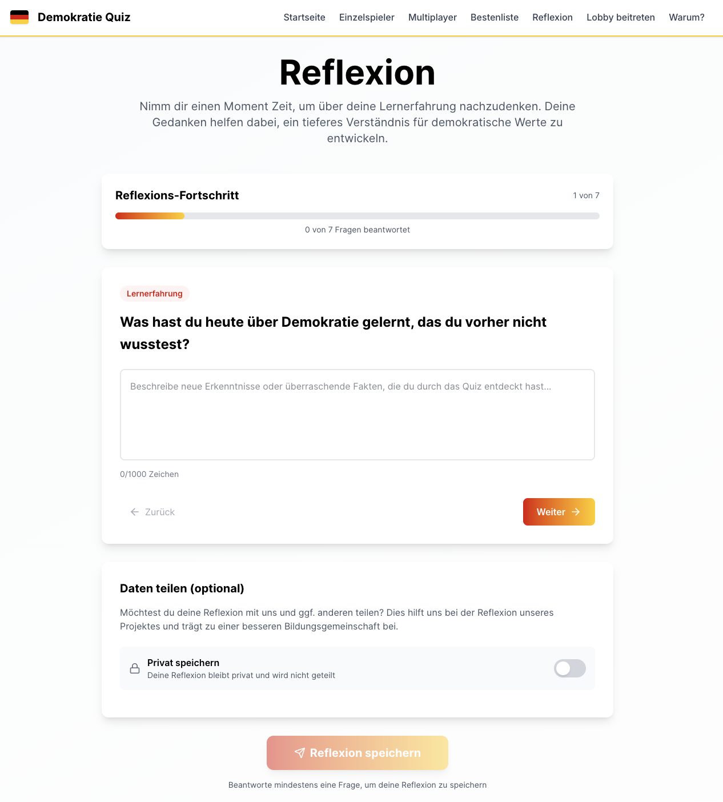
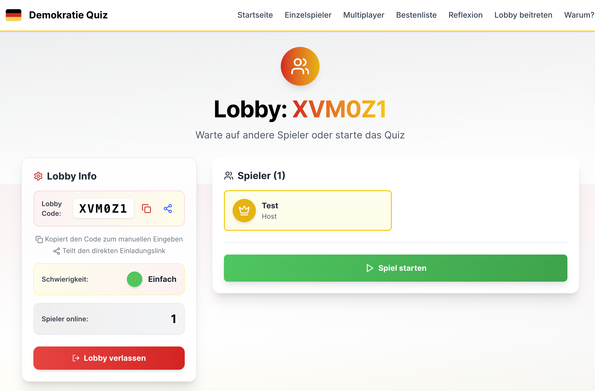

# Democracy Quiz 🏛️

[](LICENSE)

An interactive quiz application designed to deepen understanding of democratic values, processes, and civic engagement. Built as a school project in my politics course. Developed with **Next.js**, **React**, **Tailwind CSS**, **Express.js**, **Prisma**, and **PostgreSQL**.

## Table of Contents

- [Project Overview](#project-overview)
- [Key Features](#key-features)
- [Technology Stack](#technology-stack)
- [Getting Started](#getting-started)
  - [Prerequisites](#prerequisites)
  - [Installation](#installation)
  - [Environment Variables](#environment-variables)
  - [Database Setup](#database-setup)
  - [Running the Application](#running-the-application)
- [Screenshots](#screenshots)
- [Directory Structure](#directory-structure)
- [Contributing](#contributing)
- [License](#license)
- [Contact](#contact)

## Project Overview

This monorepo contains the full-stack **Democracy Quiz** project:

- **Frontend**: Next.js application using React, Tailwind CSS v4, and Framer Motion for smooth, engaging animations.
- **Backend**: Express.js server with Prisma ORM connected to a PostgreSQL database, handling quiz data, leaderboard, and session features.

## Key Features

- Multiple game modes and difficulty levels.
- Real-time multiplayer lobby support.
- Leaderboard tracking and reflection prompts.
- Responsive, accessible, and mobile-optimized UI.
- Easily extensible question database via Prisma.

## Technology Stack

- **Frontend**: Next.js, React, TypeScript, Tailwind CSS, Framer Motion.
- **Backend**: Node.js, Express.js, TypeScript, Prisma ORM, PostgreSQL.
- **DevOps**: Git, Docker (optional), Prettier, ESLint.

## Getting Started

### Prerequisites

- Node.js >= 18
- npm or yarn
- PostgreSQL database

### Installation

1. Clone the repository:

   ```bash
   git clone https://github.com/Zzackllack/Democratic-Politics-Quiz.git
   cd Democratic-Politics-Quiz
   ```

2. Install dependencies in the monorepo root:

   ```bash
   npm install
   ```

### Environment Variables

Create a `.env` file in the `applications/backend` directory (you can copy from `.example.env`):

```dotenv
DATABASE_URL="postgresql://<username>:<password>@localhost:5432/<database_name>"
```

### Database Setup

From the `applications/backend` folder:

```bash
# Generate Prisma client
npx prisma generate

# Run migrations
npx prisma migrate dev --name init

# (Optional) Seed the database
npx ts-node src/seed.ts
```

### Running the Application

#### Backend

```bash
cd applications/backend
npm run dev
```

#### Frontend

```bash
cd applications/frontend
npm run dev
```

Visit `http://localhost:3000` in your browser to explore the app.

## Screenshots







## Directory Structure

```plaintext
.
├── applications/
│   ├── frontend/        # Next.js frontend application
│   └── backend/         # Express.js backend service
├── docs/
│   └── images/          # Placeholder images and assets
├── startup-script.sh    # Local setup script
├── .gitignore
└── README.md
```

## Contributing

Contributions are welcome! Please open an issue or submit a pull request. For guidelines, refer to the codebase conventions and style in the `applications` folders.

## License

This project is licensed under the **BSD 3-Clause License**. See the [LICENSE](LICENSE) file for details.

## Contact

For questions or feedback, please reach out to the maintainers.
